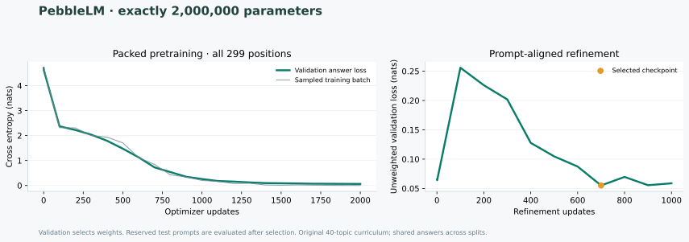

# PebbleLM · 2M

An **exactly 2,000,000-parameter** character-level transformer defined and trained using the [Pebble programming language](https://github.com/YashAnand69/pebble). Source, original curriculum and the released weights are MIT licensed.

The network, tokenizer, corpus generator, batching, learning-rate schedule, training loop, sampling and evaluation are `.pebble` programs. Pebble's optional Node extension supplies TensorFlow.js/WASM tensor kernels, automatic differentiation and AdamW. This is a real trained transformer, with no external LLM API and no Python trainer.

This is a small educational language model for a 40-topic Pebble/programming/ML curriculum. Its reserved prompts test new wording of **seen topics with shared answers**. It is not a general assistant or an unseen-knowledge benchmark.

## Web playground and deployment

The playground is a static page with a Vercel Node function at `/api/generate`. The function runs the released checkpoint on the WASM CPU backend; it does not call an external AI provider. The existing design, model, data and weights are preserved.

Use Node 24 and run `npm ci`, `npm test`, then `npm run build`. The build verifies all released artifact hashes before copying the public result reports. In Vercel, import this repository, use the **Other** framework preset, Node **24.x**, and the repository root. `vercel.json` supplies the install/build commands, public output directory, 60-second function limit and required model/WASM files. Pushes to `main` deploy production when the Vercel Git integration is connected.

For a manual deployment, run `npx vercel link` to select `pebble-llm`, then `npx vercel --prod`. To run the complete playground locally, use `npx vercel dev` after linking; serving `public/` alone does not run inference.

**No application environment variables, API keys, database or external model credentials are required.** GitHub/Vercel account access is needed only to push and deploy. Do not commit `.env*` or `.vercel/`.

Questions must use 1–160 ASCII characters; temperature is 0–1 and generation is limited to 96 characters. Invalid input returns 400, unsupported methods return 405 with `Allow: POST`, and failed inference returns a generic error. The endpoint is public and each request performs CPU inference. There is no persistent rate limiter; use Vercel Firewall rate limiting if traffic needs to be capped. The model remains educational, with 4/40 exact matches on reserved phrasings.

## Run the released model

Use Node 24 (minimum 22.13).

```sh
git clone https://github.com/YashAnand69/pebble-llm.git
cd pebble-llm
npm ci
npm run verify:artifacts
npm run inspect
npm run generate -- --prompt "What is Pebble?"
npm run generate -- --prompt "Explain attention." --temperature 0.5 --top-k 10
```

The CLI runner only launches the Pebble interpreter. The standalone runtime dependency is pinned to the Pebble 2.1 release tarball, with an integrity hash in the lockfile. It contains the interpreter and ML extension without the studio UI dependencies. No API keys or cloud compute are required. Inference runs locally on the CPU using WASM, with float32 weights.

## Measured results

| Measurement | Result |
| --- | --- |
| Trainable parameters | **2,000,000** |
| Initial validation answer loss | 4.708596 nats |
| Selected validation answer loss | 0.055105 nats |
| Reserved test answer loss | 0.235773 nats |
| Reserved test perplexity | 1.265887 |
| Reserved phrasing greedy exact answers | **4 / 40** |
| Seen training phrasing greedy exact answers | 38 / 40 |
| Main training duration | 43.27 minutes |
| Refinement duration | 12.16 minutes |

Selected checkpoint: refinement, step 700, initialized from pretraining step 2000. Measured on an Apple M5 Pro with 24 GiB RAM, Node 24.19.0 and TensorFlow.js 4.22.0 WASM CPU kernels. Durations exclude construction and initial baseline validation. Exact match uses greedy generation, up to 100 tokens; every answer, including failures, is published in [artifacts/evaluation.json](artifacts/evaluation.json). These results cover held-out phrasings of **seen topics with shared answers**.



## Architecture

| Component | Shape / count |
| --- | --- |
| Tokens | 101 × 200 = 20,200 weights |
| Learned positions | 299 × 200 = 59,800 weights |
| Decoder blocks | 4 × 480,000 = 1,920,000 weights |
| Attention | 4 heads, 50 dimensions per head |
| Feed-forward network | 200 → 800 → 200, tanh GELU |
| Normalization | Pre-LayerNorm, no affine weights, epsilon 1e-5 |
| Output | Tied token embedding, no additional output weights |
| Biases / dropout | None |
| Total | **2,000,000 trainable weights**, 18 unique parameter tensors |

The 299-position context is deliberately chosen to meet the exact size requested; it is an active learned embedding table used throughout packed training, not an unused padding parameter.

```text
(101 + 299) × 200 + 4 × (4 × 200² + 2 × 200 × 800) = 2,000,000
```

[TinyTransformer](https://github.com/YashAnand69/TinyTransformer)'s current documented architecture has 1,838,016 parameters, four layers, four heads and width 192. PebbleLM uses width 200 and context 299 to meet the requested size. No TinyTransformer code, data or pretrained weights were copied.

## Reproduce training

```sh
npm test
npm run prepare:data
npm run train -- --steps 2000 --batch 2 --length 299 --seed 2026 --lr 0.001 --report-every 100
npm run refine -- --steps 1000 --batch 4 --seed 2027 --lr 0.0005 --report-every 100
npm run evaluate
npm run evaluate:canonical
```

Training overwrites local checkpoint and report files. Verify artifact hashes before retraining; the release hashes deliberately no longer match after a new run. `best.pebble-weights` is selected only by validation answer loss; `final.pebble-weights` is an ignored final-iteration snapshot. Optimizer moments are not saved, so checkpoints support inference, not seamless training resume.

`prepare.pebble` authors 40 topics with six training formats (240 examples), two validation formats (80) and one reserved test format (40). Complete prompts differ across splits, but each topic's answer is shared. The fixed vocabulary contains 95 printable ASCII characters, newline, tab and four special tokens. Non-ASCII characters become UNK. Prompts and padding are excluded from cross entropy; EOS is supervised.

Training randomly packs documents across all 299 positions. Attention is causal across each packed row; document boundaries are not separate attention segments. Validation/test evaluate individual 96-position padded examples with positions restarting at zero. Loss is the mean of per-example supervised-token cross entropy, in natural-log units. Perplexity is its exponential. Greedy generation exact-match results complement teacher-forced loss.

A second refinement stage starts from the selected packed-training checkpoint with a fresh AdamW optimizer. It trains single 96-position prompts (batch 4), with `(full answer mean CE + 7 × first-32 answer-token mean CE) / 8`, emphasizing the beginning of each answer. It uses seed 2027, 1,000 updates, peak rate 0.0005, 25 warmup steps and the same clipping/decay/betas. Unweighted validation still selects the checkpoint; the test set stays reserved. Refinement never replaces the best checkpoint unless validation improves.

AdamW uses betas 0.9/0.95, weight decay 0.05, global gradient clipping at 1.0, a 50-step warmup and cosine decay from 0.001 to 0.0001. Parameter initialization is seeded; kernels and environment can still cause small cross-platform numerical differences.

## Files

| File | Purpose |
| --- | --- |
| `model.pebble` | Complete transformer and exact parameter count |
| `tokenizer.pebble` | Character tokenizer |
| `prepare.pebble` / `data/` | Original MIT corpus and split manifest |
| `dataset.pebble` | Tokenization, answer masking, packing and validation |
| `train.pebble` / `refine.pebble` | Packed pretraining and prompt-aligned refinement, selection and checkpointing |
| `sampling.pebble` / `generate.pebble` | Autoregressive greedy/temperature generation |
| `evaluate.pebble` | Reserved test loss and every free-generation result |
| `checkpoints/best.pebble-weights` | Released float32 model |
| `artifacts/` | Measured training/evaluation and artifact provenance |
| `tests/` | Parameter count, causality, tokenizer and training checks |

See [MODEL_CARD.md](MODEL_CARD.md) for measured results and limitations, [CONTRIBUTING.md](CONTRIBUTING.md) to contribute, and [LICENSE](LICENSE) for MIT terms. TensorFlow.js and its WASM backend retain their Apache-2.0 licenses.
